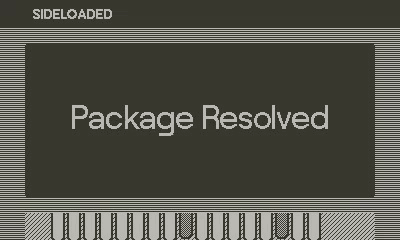

# 📦 Package Resolved for Playdate

It's another day at the Swifty Package Factory, and you have a long list
of orders to deliver, with no time to spare! Can you collect all of the
packages to deliver in the time allotted? Watch out for palettes and wet
floors, or you'll get really injured!

> **Package Resolved** is a short game written using the Playdate SDK in
> C, originating from the Godot-based game of the same title for the 132nd
> Trijam.



## 🏗️ Build instructions

**Required Tools**
- Make
- Clang or GCC
- Playdate SDK 2.1.0 or later
- (if using Nova) [Playdate extension][nova-ext]
- (if using Nova) [Icarus extension][icarus-ext]

[nova-ext]: nova://extension/?id=com.panic.Playdate&name=Playdate
[icarus-ext]: nova://extension/?id=panic.Icarus&name=Icarus

### Nova

Start by cloning this repository via `git clone`, then open the project in
Nova. Select the "Game (Simulator)" task and run the project, which will
create the PDX file and open the game in the Playdate Simulator.

> **Tip: Get Playdate autocompletions**  
> To get autocompletions and type information for the Playdate C APIs, you
> can use the `bear` tool to create a compile_commands.json file for
> relevant APIs:
>
>     ```
>     bear -- make real_all
>     ```

### Command line 

Start by cloning this repository via `git clone`, then run the following
commands in the terminal for Make:

```
make real_all
```

More information can be found on [Playdate's documentation to build via the command line][pdbuild].

[pdbuild]: https://sdk.play.date/inside-playdate-with-c/#_make

> **:warning: Unsupported on Asahi!**  
> Due to Playdate SDK restrictions, building on ARM64 Linux devices is
> not currently supported. However, you can still edit the charolette
> library and update unit tests without issue, as it only requires the
> compiler.

To build and run the unit tests, run the following:

```
make test
./test/test_app
```
